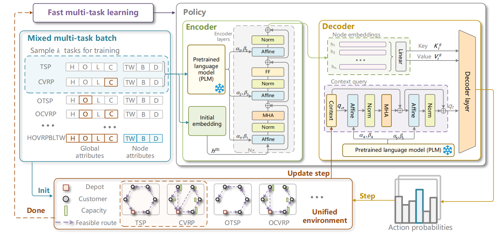

# 🤖 HMTF: Solving Diverse Routing Problems with a Hypernetwork-Based Multi-Task Framework

A unified framework for training and evaluating models across diverse routing problems.




---
## 📚 Table of Contents


- [🤖 HMTF: Solving Diverse Routing Problems with a Hypernetwork-Based Multi-Task Framework](#-hmtf-solving-diverse-routing-problems-with-a-hypernetwork-based-multi-task-framework)
  - [📚 Table of Contents](#-table-of-contents)
  - [📦 Installation](#-installation)
  - [📚 Generate PLM Embeddings](#-generate-plm-embeddings)
  - [🧪 Evaluation](#-evaluation)
    - [🔹 Evaluate a Single Model](#-evaluate-a-single-model)
    - [🔹 Evaluate All Models](#-evaluate-all-models)
  - [🏋️‍♂️ Training](#️️-training)
    - [Generate Datasets](#generate-datasets)
    - [🔸 HMTF](#-hmtf)
    - [🔸 MTPOMO](#-mtpomo)
    - [🔸 MVMOE](#-mvmoe)
    - [🔸 RF-TE](#-rf-te)
  - [🧩 Available Environments](#-available-environments)
  - [License](#license)

---


## 📦 Installation

<details>
<summary><strong>🔧 Setup Environment & Install Dependencies</strong></summary>

```bash
# 1. Create Python environment
conda create -n hmtf python=3.10

# 2. Install PyTorch with CUDA support
conda install pytorch==2.4.1 torchvision==0.19.1 torchaudio==2.4.1 pytorch-cuda=12.1 -c pytorch -c nvidia

# 3. Install required Python packages
pip install hydra-core==1.3.2
pip install lightning==2.4.0
pip install pyrootutils
pip install rich
pip install colorlog
pip install tensordict==0.5.0
pip install torchrl==0.5.0
pip install einops
pip install robust_downloader
pip install matplotlib
pip install scipy
pip install tensorboard
pip install tensorflow
pip install tensorflow_hub

# 4. Install rl4co without dependencies
pip install rl4co==0.5.0 --no-deps
```

</details>

## 📚 Generate PLM Embeddings

```bash
python PLM/generate_plm.py
```
## 🧪 Evaluation
> Due to  storage limitations, we provide our checkpoints at [Figshare](https://figshare.com/s/4ec21e83f06b0d20fa85). Please download them from there.

### 🔹 Evaluate a Single Model

```bash
python Eval.py  --checkpoint=checkpoints/50/hmtf/last.ckpt  --size=50
```

### 🔹 Evaluate All Models
```bash
bash Eval/eval_main.sh
```


## 🏋️‍♂️ Training
### Generate Datasets
```bash
python hmtf/data/generate_data.py
```
Train various models with different configurations:

### 🔸 HMTF

```bash
python run.py experiment=main/hmtf/hmtf_50.yaml logger.project_name=hmtf_50
python run.py experiment=main/hmtf/hmtf_100.yaml logger.project_name=hmtf_100
```
### 🔸 MTPOMO

```bash
python run.py experiment=main/mtpomo/mtpomo_50.yaml  logger.project_name=mtpomo_50
python run.py experiment=main/mtpomo/mtpomo_100.yaml  logger.project_name=mtpomo_100
```
### 🔸 MVMOE
```bash
python run.py experiment=main/mvmoe/mvmoe_50.yaml  logger.project_name=mvmoe_50
python run.py experiment=main/mvmoe/mvmoe_100.yaml  logger.project_name=mvmoe_100
```

### 🔸 RF-TE

```bash
python run.py experiment=main/rf/rf-te_50.yaml  logger.project_name=rf-te_50
python run.py experiment=main/rf/rf-te_100.yaml  logger.project_name=rf-te_100
```


## 🧩 Available Environments
We provide 56 routing problem variants. We consider four TSP variants using O and
TW, giving $2^2 = 4$ combinations. For VRP, we combine O, B, L, and TW with the
capacity constraint, giving $2^4 = 16$ combinations. Adding the H feature to both
families doubles the first 20 variants to 40. Finally, the Mixed (M) global feature
adds 16 VRP variants for zero-shot learning.
| Variant       | Half-asymmetric (H) | Open route (O) | Capacity (C) | Duration limit (L) | Time windows (TW) | Backhaul (B) | Mixed (M) |
|---------------|--------------------|----------------|--------------|---------------------|-------------------|--------------|-----------|
| TSP           |                    |                |              |                     |                   |              |           |
| OTSP          |                    | ✅             |              |                     |                   |              |           |
| TSPTW         |                    |                |              |                     | ✅                |              |           |
| OTSPTW        |                    | ✅             |              |                     | ✅                |              |           |
| CVRP          |                    |                | ✅           |                     |                   |              |           |
| OVRP          |                    | ✅             | ✅           |                     |                   |              |           |
| VRPB          |                    |                | ✅           |                     |                   | ✅           |           |
| VRPL          |                    |                | ✅           | ✅                  |                   |              |           |
| VRPTW         |                    |                | ✅           |                     | ✅                |              |           |
| OVRPTW        |                    | ✅             | ✅           |                     | ✅                |              |           |
| OVRPB         |                    | ✅             | ✅           |                     |                   | ✅           |           |
| OVRPL         |                    | ✅             | ✅           | ✅                  |                   |              |           |
| VRPBL         |                    |                | ✅           | ✅                  |                   | ✅           |           |
| VRPBTW        |                    |                | ✅           |                     | ✅                | ✅           |           |
| VRPLTW        |                    |                | ✅           | ✅                  | ✅                |              |           |
| OVRPBL        |                    | ✅             | ✅           | ✅                  |                   | ✅           |           |
| OVRPBTW       |                    | ✅             | ✅           |                     | ✅                | ✅           |           |
| OVRPLTW       |                    | ✅             | ✅           | ✅                  | ✅                |              |           |
| VRPBLTW       |                    |                | ✅           | ✅                  | ✅                | ✅           |           |
| OVRPBLTW      |                    | ✅             | ✅           | ✅                  | ✅                | ✅           |           |
| HTSP          | ✅                 |                |              |                     |                   |              |           |
| HOTSP         | ✅                 | ✅             |              |                     |                   |              |           |
| HTSPTW        | ✅                 |                |              |                     | ✅                |              |           |
| HOTSPTW       | ✅                 | ✅             |              |                     | ✅                |              |           |
| HCVRP         | ✅                 |                | ✅           |                     |                   |              |           |
| HOVRP         | ✅                 | ✅             | ✅           |                     |                   |              |           |
| HVRPB         | ✅                 |                | ✅           |                     |                   | ✅           |           |
| HVRPL         | ✅                 |                | ✅           | ✅                  |                   |              |           |
| HVRPTW        | ✅                 |                | ✅           |                     | ✅                |              |           |
| HOVRPTW       | ✅                 | ✅             | ✅           |                     | ✅                |              |           |
| HOVRPB        | ✅                 | ✅             | ✅           |                     |                   | ✅           |           |
| HOVRPL        | ✅                 | ✅             | ✅           | ✅                  |                   |              |           |
| HVRPBL        | ✅                 |                | ✅           | ✅                  |                   | ✅           |           |
| HVRPBTW       | ✅                 |                | ✅           |                     | ✅                | ✅           |           |
| HVRPLTW       | ✅                 |                | ✅           | ✅                  | ✅                |              |           |
| HOVRPBL       | ✅                 | ✅             | ✅           | ✅                  |                   | ✅           |           |
| HOVRPBTW      | ✅                 | ✅             | ✅           |                     | ✅                | ✅           |           |
| HOVRPLTW      | ✅                 | ✅             | ✅           | ✅                  | ✅                |              |           |
| HVRPBLTW      | ✅                 |                | ✅           | ✅                  | ✅                | ✅           |           |
| HOVRPBLTW     | ✅                 | ✅             | ✅           | ✅                  | ✅                | ✅           |           |
| VRPMB         |                    |                | ✅           |                     |                   | ✅           | ✅        |
| OVRPMB        |                    | ✅             | ✅           |                     |                   | ✅           | ✅        |
| VRPMBL        |                    |                | ✅           | ✅                  |                   | ✅           | ✅        |
| VRPMBTW       |                    |                | ✅           |                     | ✅                | ✅           | ✅        |
| OVRPMBL       |                    | ✅             | ✅           | ✅                  |                   | ✅           | ✅        |
| OVRPMBTW      |                    | ✅             | ✅           |                     | ✅                | ✅           | ✅        |
| VRPMBLTW      |                    |                | ✅           | ✅                  | ✅                | ✅           | ✅        |
| OVRPMBLTW     |                    | ✅             | ✅           | ✅                  | ✅                | ✅           | ✅        |
| HVRPMB        | ✅                 |                | ✅           |                     |                   | ✅           | ✅        |
| HOVRPMB       | ✅                 | ✅             | ✅           |                     |                   | ✅           | ✅        |
| HVRPMBL       | ✅                 |                | ✅           | ✅                  |                   | ✅           | ✅        |
| HVRPMBTW      | ✅                 |                | ✅           |                     | ✅                | ✅           | ✅        |
| HOVRPMBL      | ✅                 | ✅             | ✅           | ✅                  |                   | ✅           | ✅        |
| HOVRPMBTW     | ✅                 | ✅             | ✅           |                     | ✅                | ✅           | ✅        |
| HVRPMBLTW     | ✅                 |                | ✅           | ✅                  | ✅                | ✅           | ✅        |
| HOVRPMBLTW    | ✅                 | ✅             | ✅           | ✅                  | ✅                | ✅           | ✅        |

## License

This project is available under the [MIT License](LICENSE).

We gratefully acknowledge [RouteFinder](https://github.com/ai4co/routefinder),
whose codebase provided an important foundation for this work.
